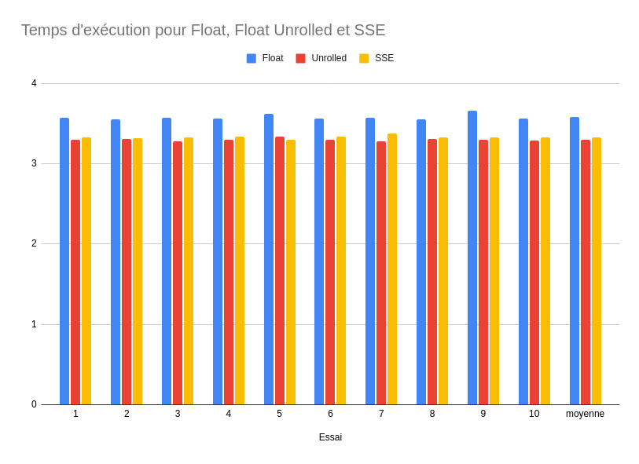

# TP SIMD - Conception et Exploration d'Architectures Multicoeurs

L'objectif de ce TP est d'utiliser des opérations SIMD (Single Instruction, Multiple Data) x86_64, et plus particulièrement les extensions SSE d'Intel dans le but de décoder une vidéo au format motion jpeg et de travailler sur des registres de 128 bits.

## Pré-requis

L'exécution de ce TP nécessite d'avoir un processeur Intel x86_64 et la librarie SDL1.2 (ou SDL12-compat).

## Compilation et exécution

Tout ce dont nous avons besoin se trouve dans le dossier `tp2_src_etd`.

La vidéo à décoder est : `tp2_src_etd/ice_age_256x144_444.mjpeg`.
Les trois implémentations de la conversion de flottants sont les suivantes :
- `conv-float.c` : conversion de flottants "classique", sans optimisation particulière
- `conv-unrolled4-float-a-trou.c` : conversion de flottants 4 par 4 par rapport à l'implémentation classique
- `conv-sse-a-trou.c` : conversion de flottants 4 par 4 en utilisant utilisant des registres de 128 bits et des instructions SSE

Pour compiler une de ces méthodes de conversion, il suffit d'utiliser :
```
make <mjpeg-float | mjpeg-conv-unrolled4-float-a-trou | mjpeg-conv-sse-a-trou>
```

L'exécutable créé prend 1, 2 ou 3 arguments. Le premier est le nom de la vidéo (`ice_age_256x144_444.mjpeg`), le second est un entier donnant le nombre de frames à décoder (toutes si `-1`), et le troisième, qui n'est pas obligatoire, permet de ne pas afficher le résultat : on peut alors mesurer la vitesse brute du décodage. Ainsi, pour voir combien de temps prend le décodage sur le film complet, il suffit de lancer :
```
time ./mjpeg-float ice_age_256x144_444.mjpeg -1 azerty
```

## Résultats
Sur les trois implémentation présentées et sur 10 exécutions, nous avons obtenu les résultats suivant :

On se rend compte que les implémentations Float Unrolled et SSE sont légèrement plus rapides que l'implémentation Float classique, mais que l'utilisation d'instructions SSE, sur la machine sur laquelle nous avons réalisé ce TP, n'offre pas forcément de meilleures performances que la conversion 4 par 4.